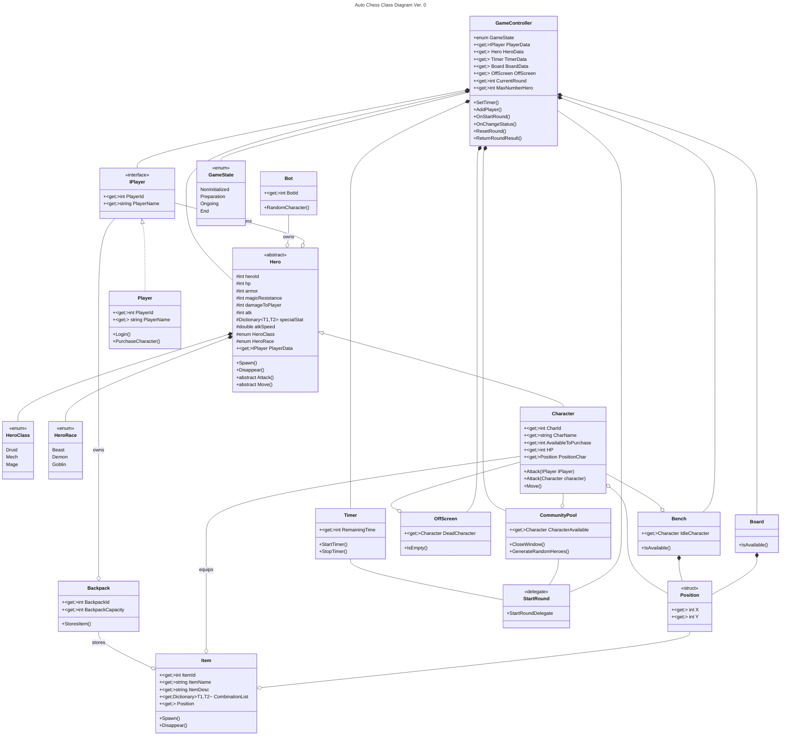

```mermaid
---
title: Auto Chess Class Diagram Ver. 0
---
classDiagram
    IPlayer --o Hero :owns
    Bot --o Hero :owns
    Hero *-- HeroClass
    Hero *-- HeroRace
    Hero <|-- Character
    Board *-- Position
    Position --o Character
    Position --o Item
    Character --o Item :equips
    Backpack --o Item :stores    
    IPlayer --o Backpack :owns
    GameController *-- Hero    
    GameController *-- IPlayer
    GameController -- GameState    
    IPlayer <|.. Player
    Bench *-- Position
    GameController *-- Timer  
    GameController *-- Board  
    GameController *-- Bench  
    GameController *-- OffScreen   
    Character --o OffScreen
    Character --o Bench
    Character --o CommunityPool
    GameController *-- CommunityPool  
    GameController -- StartRound 
    CommunityPool -- StartRound  
    Timer -- StartRound     

    class IPlayer {
        <<interface>>
        +~get;~int PlayerId
        +~get;~string PlayerName
    }
    class Player {
        +~get;~int PlayerId
        +~get;~ string PlayerName
        +Login()
        +PurchaseCharacter()
    }    
    class Bot {
        +~get;~int BotId
        +RandomCharacter()
    }
    class Timer {
        +~get;~int RemainingTime
        +StartTimer()
        +StopTimer()
    }
    class StartRound {
        <<delegate>>
        +StartRoundDelegate
    }
    class GameController {
        +enum GameState
        +~get;~IPlayer PlayerData
        +~get;~ Hero HeroData
        +~get;~ Timer TimerData
        +~get;~ Board BoardData
        +~get;~ OffScreen OffScreen
        +~get;~int CurrentRound
        +~get;~int MaxNumberHero
        +SetTimer()
        +AddPlayer()
        +OnStartRound()
        +OnChangeStatus()
        +ResetRound()
        +ReturnRoundResult()
    }
    class GameState {
        <<enum>>
        NonInitialized
        Preparation
        Ongoing
        End
    }
    class Hero {
        <<abstract>>
        #int heroId
        #int hp
        #int armor
        #int magicResistance
        #int damageToPlayer
        #int atk
        #Dictionary~T1,T2~ specialStat
        #double atkSpeed
        #enum HeroClass
        #enum HeroRace
        +~get;~IPlayer PlayerData
        +Spawn()
        +Disappear()
        +abstract Attack()
        +abstract Move()
    }
    class HeroClass {
    <<enum>> 
    Druid
    Mech
    Mage
    }
    class HeroRace {
    <<enum>> 
    Beast
    Demon
    Goblin
    }
    class Position {
    <<struct>>
        +~get;~ int X
        +~get;~ int Y
    }
    class Board {
        +IsAvailable()
    }
    class Bench {
        +~get;~Character IdleCharacter
        +IsAvailable()
    }
    class OffScreen {
        +~get;~Character DeadCharacter
        +IsEmpty()
    }
    class CommunityPool {
        +~get;~Character CharacterAvailable
        +CloseWindow()
        +GenerateRandomHeroes()
    }
    class Character{
        +~get;~int CharId
        +~get;~string CharName
        +~get;~int AvailableToPurchase  
        +~get;~int HP        
        +~get;~Position PositionChar
        +Attack(IPlayer iPlayer)
        +Attack(Character character)
        +Move()
    }
    class Item{
        +~get;~int ItemId
        +~get;~string ItemName
        +~get;~string ItemDesc
        +~get;Dictionary~T1,T2~ CombinationList        
        +~get;~ Position
        +Spawn()
        +Disappear()
    }
    class Backpack{
        +~get;~int BackpackId
        +~get;~int BackpackCapacity
        +StoresItem()
    }
```