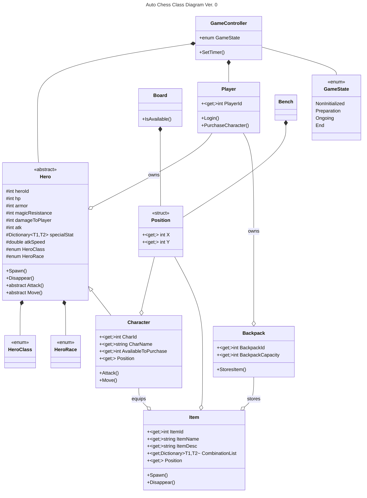

```mermaid
---
title: Auto Chess Class Diagram Ver. 0
---
classDiagram
    Player --o Hero :owns
    Hero *-- HeroClass
    Hero *-- HeroRace
    Hero <|-- Character
    Board *-- Position
    Position --o Character
    Position --o Item
    Character --o Item :equips
    Backpack --o Item :stores    
    Player --o Backpack :owns
    GameController *-- Hero    
    GameController *-- Player
    GameController -- GameState
    Bench *-- Position

    class Player {
        +~get;~int PlayerId
        +Login()
        +PurchaseCharacter()
    }
    class GameController {
        +enum GameState
        +SetTimer()
    }
    class GameState {
        <<enum>>
        NonInitialized
        Preparation
        Ongoing
        End
    }
    class Hero {
        <<abstract>>
        #int heroId
        #int hp
        #int armor
        #int magicResistance
        #int damageToPlayer
        #int atk
        #Dictionary~T1,T2~ specialStat
        #double atkSpeed
        #enum HeroClass
        #enum HeroRace
        +Spawn()
        +Disappear()
        +abstract Attack()
        +abstract Move()
    }
    class HeroClass
    <<enum>> HeroClass
    class HeroRace
    <<enum>> HeroRace
    class Position {
    <<struct>>
        +~get;~ int X
        +~get;~ int Y
    }
    class Board {
        +IsAvailable()
    }
    class Character{
        +~get;~int CharId
        +~get;~string CharName
        +~get;~int AvailableToPurchase        
        +~get;~ Position
        +Attack()
        +Move()
    }
    class Item{
        +~get;~int ItemId
        +~get;~string ItemName
        +~get;~string ItemDesc
        +~get;Dictionary~T1,T2~ CombinationList        
        +~get;~ Position
        +Spawn()
        +Disappear()
    }
    class Backpack{
        +~get;~int BackpackId
        +~get;~int BackpackCapacity
        +StoresItem()
    }
```
