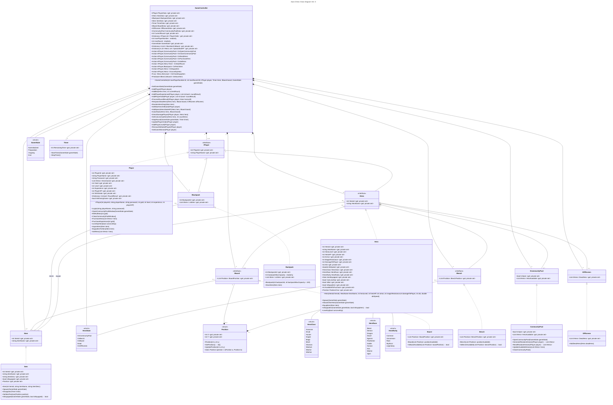

```mermaid
---
title: Auto Chess Class Diagram Ver. 0
---
classDiagram
    GameController "1" *-- "0..*" IHero    
    GameController "1" *-- "1..8" IPlayer
    GameController "1" *-- "0..*" IItem
    GameController -- GameState  
    GameController -- HeroState  
    GameController "1" *-- "1" Timer  
    GameController "1" *-- "1" IBoard  
    GameController "1" *-- "1" IBench  
    GameController "1" *-- "1" IOffScreen      
    GameController "1" *-- "1" ICommunityPool  
    GameController "1" *-- "1" IBackpack 

    IBoard "1" --* "0..1" Position 
    IBench "0..1" --* "1..*" Position
    IBoard "0..1" --o "0..*" IItem
    IBackpack "0..1" --o "0..100" IItem :stores

    IHero <|.. Hero
    IHero "0..*" o-- "0..1" IOffScreen
    IHero "0..*" o-- "0..1" IBoard
    IHero "0..*" o-- "0..1" IBench
    IHero "0..*" o-- "1..*" ICommunityPool
    IHero "0..*" o-- "0..1" IItem :equips 

    IPlayer "1" o-- "1" IBackpack
    IPlayer "1" o-- "0..*" IHero    
    IPlayer <|.. Player 
    
    Hero -- HeroClass
    Hero -- HeroRace
    Hero -- HeroState
    Hero -- HeroRarity

    IItem <|.. Item
    IBoard <|.. Board
    IBench <|.. Bench
    ICommunityPool <|.. CommunityPool
    IBackpack <|.. Backpack
    IOffScreen <|.. OffScreen
    
    class GameState {
        <<enum>>
        NonInitialized
        Preparation
        Ongoing
        End
    }
    class HeroClass {
        <<enum>>
        Assassin
        Druid
        Hunter
        Knight
        Mage
        Mech
        Shaman
        Warlock
        Warrior
        Witcher
    }
    class HeroRace {
        <<enum>>
        Beast
        Demon
        Dragon
        Dwarf
        Egersis
        Feathered
        Goblin
        Human
        Kira
        Marine
        Spirit
    }
    class HeroRarity {
        <<enum>>
        Common
        Uncommon
        Rare
        Mythical
        Legendary
    }
    class HeroState {
        <<enum>>
        OnCommunityPool
        OnBench
        OnBoard
        Dead
        OnOffScreen
    }
    class Position {
    <<struct>>
        +int X ~get; private set~
        +int Y ~get; private set~
        +Position(int x,int y)
        +GetPosition() : int[]
        +UpdatePosition(int x,int y)
        +static Position operator == (Position a, Position b)
    }
    class IBackpack {
        +int BackpackId ~get; private set~
        +List~IItem~ ListItem ~get; private set~
    }
    class Backpack{
        +int BackpackId ~get; private set~
        +int backpackMaxCapacity : readonly
        +List~IItem~ ListItem ~get; private set~
        +Backpack(int backpackId, int backpackMaxCapacity = 100)
        +StoreItem(IItem item)
    }
    class IBench {
        <<interface>>
        +List~Position~ BenchPosition ~get; private set~
    }
    class Bench {
        +List~Position~ BenchPosition ~get; private set~
        +Bench(List~Position~ positionAvailable)
        +IsBenchAvailable(List~Position~ benchPosition) : bool
    }    
    class IBoard {
        <<interface>>
        +List~Position~ BoardPosition ~get; private set~
    }
    class Board {
        +List~Position~ BoardPosition ~get; private set~
        +Board(List~Position~ positionAvailable)
        +IsBoardAvailable(List~Position~ boardPosition) : bool
    }    
    class ICommunityPool {
        +bool IsOpen ~get; private set~        
        +List~IHero~ HeroAvailable ~get; private set~
    }
    class CommunityPool {
        +bool IsOpen ~get; private set~        
        +List~IHero~ HeroAvailable ~get; private set~
        +OpenCommunityPool(GameState gameState)
        +GenerateRandomHeroes(IPlayer player) : List~IHero~
        +RerollRandomHeroes(IPlayer player) : List~IHero~
        +UpdateAvailableHeroes(List~IHero~ hero)
        +CloseCommunityPool()
    }
    class GameController {
        +IPlayer PlayerData ~get; private set~ 
        +IHero HeroData ~get; private set~
        +IBackpack BackpackData ~get; private set~
        +IItem ItemData ~get; private set~
        +Timer TimerData ~get; private set~ 
        +IBoard BoardData ~get; private set~
        +IOffScreen OffScreenData ~get; private set~ 
        +ICommunityPool CommunityPoolData ~get; private set~ 
        +int CurrentRound ~get; private set~
        +Dictionary~IPlayer,int~ PlayerOrder ~get; private set~
        +int maxPlayerNumber : readonly
        +int maxRound : readonly
        +GameState GameState ~get; private set~
        +Dictionary~int,int~ MaxHeroOnBoard ~get; private set~
        +Dictionary~List~IHero~,int~ SpecialStatHP ~get; private set~
        +Action~IPlayer,ICommunityPool~ OnOpenCommunityPool
        +Action~IPlayer,ICommunityPool~ OnCloseCommunityPool
        +Action~IPlayer,ICommunityPool~ OnRerollHero
        +Action~IPlayer,ICommunityPool~ OnPurchaseHero
        +Action~IPlayer,ICommunityPool~ OnSellHero
        +Action~IPlayer,IHero,Timer~ OnStartRound
        +Action~IPlayer,IBackpack~ OnFetchItem
        +Action~IPlayer,IHero~ OnEquipItem
        +Action~IPlayer,IHero~ OnLevelUpHero        
        +Func~IHero,IItem,bool~ OnCheckEquipItem     
        +Predicate~IBench,IBoard~ OnMoveHero
        +GameController(int maxPlayerNumber=8, int maxRound=50, IPlayer player, Timer timer, IBoard board, GameState gameState)
        +SetGameState(GameState gameState)
        +AddPlayer(IPlayer player)
        +AddBot(IHero hero, int currentRount)
        +AddPlayerExperience(IPlayer player, List~int,bool~ roundResult)
        +AddPlayerGold(IPlayer player, List~int,bool~ roundResult)
        +ProcessRoundResult(IPlayer player, IHero heroLeft)    
        +RespawnDeadHero(IHero hero, IBoard board, IOffScreen offScreen)
        +RandomItemDrop(IItem item)
        +SetMaxHeroOnBoard(IPlayer player)
        +AddSpecialHeroStateHP(IHero hero, IBoard board)
        +AutoAttack(IHero hero, IBoard board)
        +DirectDamagePlayer(IPlayer player, IHero hero)
        +SetCanLeveUpHero(IHero hero, int countHero)   
        +StopRound(GameState gameState, Timer timer)
        +UpdatePlayerOrder(IPlayer player)  
        +AddPlayerLevel(IPlayer player) 
        +RemoveDefeatedPlayer(IPlayer player)  
        +SetGameWinner(IPlayer player) 
    }
    class IHero {
        <<interface>>
        +int HeroId ~get; private set~
        +string HeroName ~get; private set~
    }
    class Hero{
        +int HeroId ~get; private set~
        +string HeroName ~get; private set~   
        +int HeroLevel ~get; private set~    
        +int HeroHP ~get; private set~
        +int Armor ~get; private set~
        +int MagicResistance ~get; private set~
        +int DamageToPlayer ~get; private set~
        +int Atk ~get; private set~
        +double AtkSpeed ~get; private set~
        +HeroClass HeroClass ~get; private set~
        +HeroRace HeroRace ~get; private set~
        +HeroRarity HeroRarity ~get; private set~
        +IItem itemEquipped ~get; private set~
        +bool CanLevelUp ~get; private set~
        +bool IsBot ~get; private set~
        +bool IsEquipItem ~get; private set~  
        +int AvailableToPurchase ~get; private set~ 
        +Position PositionChar ~get; private set~
        +Hero(HeroId heroId, HeroName heroName, int heroLevel, int heroHP, int armor, int magicResistance,int damageToPlayer, int atk, double atkSpeed)
        +Spawn(GameState gameState)
        +AttackOtherHero(GameState gameState)
        +EquipItem(IItem item)
        +IsEquipItem(GameState gameState, bool isEquipItem) : bool
        +LevelUp(bool canLevelUp)
    }    
    class IItem{
        +int ItemId ~get; private set~
        +string ItemName ~get; private set~
    }
    class Item{
        +int ItemId ~get; private set~
        +string ItemName ~get; private set~
        +string ItemDesc ~get; private set~ 
        +bool IsEquipped ~get; private set~     
        +Position ~get; private set~
        +Item(int itemId, string itemName, string itemDesc)
        +Spawn(GameState gameState)
        +Disappear(Timer timer)
        +SetItemPosition(Position position)
        +IsEquipped(GameState gameState, bool isEqupped) : bool
    }
    class IOffScreen {
        +List~IHero~ DeadHero ~get; private set~
    }
    class OffScreen {
        +List~IHero~ DeadHero ~get; private set~
        +AddDeadHero(IHero deadHero)
    }
    class IPlayer {
        <<interface>>
        +int PlayerId ~get; private set~
        +string PlayerName ~get; private set~
    }    
    class Player {
        +int PlayerId ~get; private set~
        +string PlayerName ~get; private set~
        +string Password ~get; private set~
        +List~IHero~ HeroOwned ~get; private set~
        +int Gold ~get; private set~
        +int Level ~get; private set~
        +int Experience ~get; private set~
        +int PlayerHP ~get; private set~
        +int WinStreak ~get; private set~
        +Dictionary~int,bool~ RoundResult ~get; private set~
        +bool IsWinningGame ~get; private set~
        +Player(int playerId, string playerName, string password, int gold, int level, int experience, int playerHP)
        +Login(string playerName, string password)
        +OpenCommunityPoolWindow(GameState gameState)
        +ReRollHero(int gold)
        +CloseCommunityPoolWindow()
        +PurchaseHero(List~IHero~ hero)
        +PurchaseExperience(int gold)
        +LevelUpHero(bool canLevelUp)
        +AquireItem(IItem item)
        +EquipItemToHero(IItem item)
        +SellHero(List~IHero~ hero)
    }
    class Timer {
        +int RemainingTime ~get; private set~
        +StartTimer(GameState gameState)
        +StopTimer()
    }
```