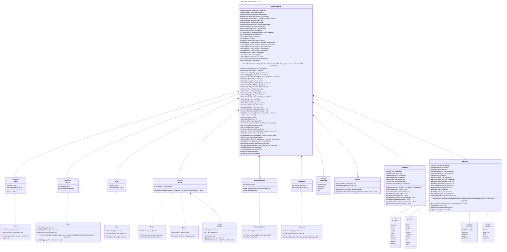

```mermaid
---
title: Auto Chess Class Diagram Ver. 1.0
---
classDiagram

    IHero <|.. Hero
    IItem <|.. Item    
    IBackpack <|.. Backpack
    Board <|.. Arena
    Board <|.. Bench

    Board "1" *-- "0..1" Position
    ICommunityPool <|.. CommunityPool
    GameController "1" *-- "0..*" IHero    
    GameController "1" *-- "1..8" IPlayer
    GameController "1" *-- "0..*" IItem
    GameController -- GameState  
    GameController "1" *-- "1" Board  
    GameController "1" *-- "1" ItemData    
    GameController "1" *-- "1" ICommunityPool  
    GameController "1" *-- "1" IBackpack   
    GameController "1" *-- "1..*" PlayerData   
    GameController "1" *-- "1..*" HeroData 
    IPlayer <|.. Player 
    
    HeroData -- HeroClass
    HeroData -- HeroRace
    HeroData -- HeroState
    HeroData -- HeroRarity
    
    class GameState {
        <<enum>>
        NonInitialized
        Preparation
        Ongoing
        End
    }
    class HeroClass {
        <<enum>>
        Assassin
        Druid
        Hunter
        Knight
        Mage
        Mech
        Shaman
        Warlock
        Warrior
        Witcher
    }
    class HeroRace {
        <<enum>>
        Beast
        Demon
        Dragon
        Dwarf
        Egersis
        Feathered
        Goblin
        Human
        Kira
        Marine
        Spirit
    }
    class HeroRarity {
        <<enum>>
        Common
        Uncommon
        Rare
        Mythical
        Legendary
    }
    class HeroState {
        <<enum>>
        OnCommunityPool
        OnBench
        OnBoard
        Dead
        OnOffScreen
    }
    class Position {
    <<struct>>
        +int X ~get; private set~
        +int Y ~get; private set~
        +Position(int x,int y)
        +UpdatePosition(int x,int y) : bool
        +static Position operator == (Position a, Position b)
    }
    class IBackpack {
        +int BackpackId ~get;~
        +int backpackMaxCapacity 
    }
    class Backpack{
        +int BackpackId ~get; private set~
        +int backpackMaxCapacity readonly
        +Backpack(int backpackId, int backpackMaxCapacity = 100)
    }    
    class Board {
        <<abstract>>
        #List~Position~ _boardPosition
        +IsPositionAvailable(GameState gameState, List~Position~ boardPosition) : bool
    }
    class Arena {
        -List~Position~ _boardPosition 
        +Board(List~Position~ positionAvailable)
        +AddBoardPosition(Position position)
    }
    class Bench {
        -List~Position~ _boardPosition 
        +Bench(List~Position~ positionAvailable)
    }       
    class ICommunityPool {
        +bool IsOpen ~get;~    
        %%method to change the value of IsOpen
        +OpenCommunityPool(GameState gameState)
        +CloseCommunityPool()  
    }
    class CommunityPool {
        +bool IsOpen ~get; private set~   
        +OpenCommunityPool(GameState gameState)
        +CloseCommunityPool()  
    }
    class GameController {
        -Dictionary~IPlayer, PlayerData~ playerData  
        -Dictionary~IHero, HeroData~ heroData
        -Dictionary~IPlayer,IBackpack~ backpackData 
        -Dictionary< IPlayer, List< IHero > > herosPlayer
        -Dictionary< ICommunityPool, List< IHero > > heroOnStore
        -Dictionary~IItem, ItemData~ itemData 
        -Dictionary~IHero, IItem~ itemEquipped
        -Dictionary< IBackpack, List< IItem > > itemStored
        -Dictionary~IPlayer,int~ maxHeroOnBoard
        -Dictionary< List~IHero~,int > specialStatHP
        +Board BoardData ~get; private set~ 
        +ICommunityPool CommunityPoolData ~get; private set~ 
        +int CurrentRound ~get; private set~
        +int maxPlayerNumber : readonly
        +int maxRound : readonly
        +GameState GameState ~get; private set~
        +Action~IPlayer,ICommunityPool~ OnOpenCommunityPool
        +Action~IPlayer,ICommunityPool~ OnCloseCommunityPool
        +Action~IPlayer,ICommunityPool~ OnPurchaseHero
        +Action~IPlayer,ICommunityPool~ OnRerollHero
        +Action~IPlayer,ICommunityPool~ OnSellHero
        +Action~IBackpack,IItem~ OnFetchItem
        +Action~IHero,IItem~ OnEquipItem
        +Action~IPlayer,IHero~ OnLevelUpHero        
        +Func < IHero,IItem,bool > OnCheckEquipItem     
        +Predicate~Board~ OnMoveHero
        +GameController(int maxPlayerNumber=8, int maxRound=50, IPlayer player, Board board, GameState gameState)
        %%Getter 
        +GetPlayerData(IPlayer player) : PlayerData
        +GetHeroData(IHero hero) : HeroData
        +GetBackpackData(IPlayer player) : IBackpack
        +GetHerosPlayer(IPlayer player) : List~IHero~ 
        +GetHeroOnStore(ICommunityPool communityPool) : List~IHero~ 
        +GetItemData(IItem item) : ItemData
        +GetItemEquipped(IHero hero) : IItem
        +GetItemStored(IBackpack backpack) : List~IItem~
        +GetMaxHeroOnBoard(IPlayer player) : int
        +GetSpecialStatHP(List~IHero~ heroOnBoard) : int
        %%Overloading Getter
        +GetPlayerData() : IPlayer, PlayerData
        +GetHeroData() : IHero, HeroData
        +GetBackpackData() : IPlayer, IBackpack
        +GetHerosPlayer() : IPlayer, List~IHero~ 
        +GetHeroOnStore() : ICommunityPool, List~IHero~ 
        +GetItemData() : IItem, ItemData
        +GetItemEquipped() : IHero, IItem
        +GetItemStored() : IBackpack, List~IItem~
        +GetMaxHeroOnBoard() : IPlayer, int
        +GetSpecialStatHP() : List~IHero~, int
        %%Setter
        +SetGameState(GameState gameState) : bool
        +RemoveDefeatedPlayer(IPlayer player) : bool
        +ReRollHero(ICommunityPool communityPool) : List~IHero~
        %%Other methods  
        +AddPlayer(IPlayer player)
        +CreateBoard(Board board)
        +CheckPlayerNumber() : int
        +StartRound(GameState gameState)
        +GenerateHeroesOnStore(ICommunityPool communityPool)
        +AddPlayerExperience(IPlayer player)
        +AddPlayerGold(IPlayer player)  
        +RandomItemDrop(IHero bot, IItem item)
        +AcquireItem(IPlayer player, IBackpack backpack, IItem item)
        +AddBot(IHero hero, int currentRound)
        +RespawnDeadHero(IPlayer player, IHero hero, Board board)
        +SetMaxHeroOnBoard(IPlayer player)
        +AddSpecialHeroStateHP(IPlayer player, IHero hero, Board board)
        +AutoAttack(IPlayer player, IHero hero, Board board)
        +DirectDamagePlayer(IPlayer player, IHero hero)
        +SetCanLeveUpHero(IPlayer player, IHero hero, int countHero)   
        +StopRound(GameState gameState)
        +PurchaseExperience(IPlayer player) 
        +LevelUpPlayer(IPlayer player)
        +SetGameWinner(IPlayer player) 
    }
    class IHero {
        <<interface>>
        +int HeroId ~get;~
        +string HeroName ~get;~
        +Copy() : IHero
    }
    class Hero{
        +int HeroId ~get; private set~
        +string HeroName ~get; private set~   
        +Hero(HeroId heroId, HeroName heroName)
        +Copy() : Hero
    }    
    class HeroData {
        +int HeroLevel ~get; private set~    
        +int HeroHP ~get; private set~
        +int Armor ~get; private set~
        +int MagicResistance ~get; private set~
        +int DamageToPlayer ~get; private set~
        +int Atk ~get; private set~
        +double AtkSpeed ~get; private set~
        +HeroClass HeroClass ~get; private set~
        +HeroRace HeroRace ~get; private set~
        +HeroRarity HeroRarity ~get; private set~
        +IItem ItemEquipped ~get; private set~
        +bool CanLevelUp ~get; private set~
        +bool IsBot ~get; private set~
        +bool IsEquipItem ~get; private set~
        +bool IsDroppingItem ~get; private set~  
        +int AvailableToPurchase ~get; private set~ 
        +HeroData(int heroLevel, int heroHP, int armor, int magicResistance,int damageToPlayer, int atk, double atkSpeed)
        %%triggered by game console
        +EquipItem(GameState gameState, bool isEqupItem) : bool
        +LevelUp(bool canLevelUp)
        +UpdateAvailableToPurchase(int qty)
        +UpdateDroppingItem(bool isBot)
    }
    class IItem{
        +int ItemId ~get;~
        +string ItemName ~get;~
    }
    class Item{
        +int ItemId ~get; private set~
        +string ItemName ~get; private set~
        +Item(int itemId, string itemName)
    }
    class ItemData{
        +string ItemDesc ~get; private set~ 
        +bool IsEquipped ~get; private set~
        +ItemData(string itemDesc, bool IsEquipped)
        %%triggered by game console
        +UpdateEquipStatus(GameState gameState, bool isEqupped) : bool
    }
    class IPlayer {
        <<interface>>
        +int PlayerId ~get;~
        +string PlayerName ~get;~
    }    
    class Player {
        +int PlayerId ~get; private set~
        +string PlayerName ~get; private set~
        +string Password ~get; private set~
        +Player(int playerId, string playerName, string password, int gold, int level, int experience, int playerHP)
        +Login(string playerName, string password)
    }
    class PlayerData {        
        +int Gold ~get; private set~
        +int Level ~get; private set~
        +int Experience ~get; private set~
        +int PlayerHP ~get; private set~
        +int WinStreak ~get; private set~
        -Dictionary~int,bool~ roundResult
        +bool IsWinningGame ~get; private set~
        +PlayerData(int gold, int level, int experience, int playerHP)
        +GetRoundResult(int round) : bool
        %%triggered by game console
        +ReceiveDirectDamage(int atkDamage)
        +UpdatePlayerGold(int gold) : bool
        +UpdatePlayerLevel(int level) : bool
        +UpdatePlayerExperience(int experience) : bool
        +UpdateWinStreak(int winStreak) : bool
        +UpdateRoundResult(Dictionary~int,bool~) : bool
        +UpdateIsWinning(bool isWinning) : bool
    }
```